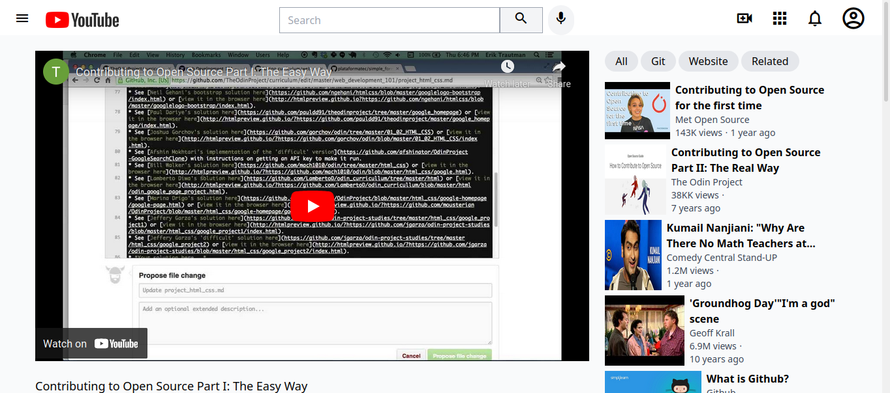

# Readme
# Youtube Clone

## Overview

The goal of this project was to clone a Youtube page, making sure that the media
elements show up.  [This](https://web.archive.org/web/20200704195750/https://www.youtube.com/watch?v=V74l_zS1x8E) 
was the original page to clone, for reference and comparison.

### Challenge

The design requirements from The Odin Project are detailed
[here](https://www.theodinproject.com/paths/full-stack-javascript/courses/html-and-css/lessons/embedding-images-and-video)

### Screenshot

  

### Links

- [Live site](https://mattdimicelli.github.io/Tailwind_Youtube_Video_Player/)
- [Repo](https://github.com/mattdimicelli/Tailwind_Youtube_Video_Player/)

## My process

### Built with

- Tailwind CSS
- Semantic HTML
- Material Design Icons via Google's Font Service

### What I learned

- The main learning points were HTML's built-in capabilities to work with media
such as images and videos, as well as about `<iframe>`, which is what was used 
in this webpage.  
